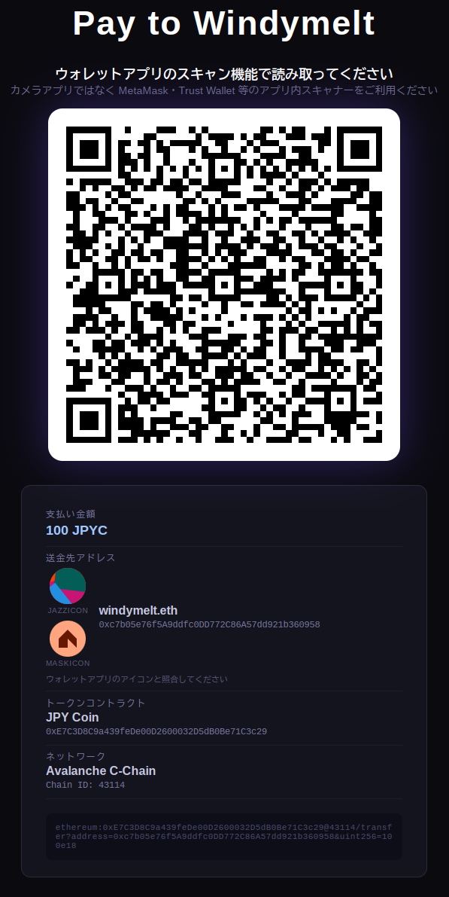

# jpyc-qr-signboard



ERC-20トークンの支払いを受け付けるサイネージ用画面を生成するScala 3製CLIツールです。

ERC-681 URIをQRコードとして表示し、MetaMaskなどのウォレットアプリでスキャンするだけで送金できます。

> [!CAUTION]
> ここで提供しているツールはすべて非公式です。このツールを利用することによって発生したいかなる損害も作者は負いません。このツールを使用したことにより、自動的にこの条件を受諾したものとみなします。
> 
> このリポジトリは BSD-3-Clause License によってライセンスされています。

## 機能

- **ERC-681 QRコード** — ウォレットアプリで読み取るだけで送金画面が開く
- **ENS名対応** — `--to windymelt.eth` のようにENS名を指定可能。ブラウザ側でアドレスを解決する
- **トークン情報の自動取得** — `symbol()` と `decimals()` をコントラクトから取得。`--decimals` は取得失敗時のフォールバック
- **チェーン名の自動解決** — [ethereum-lists](https://github.com/ethereum-lists/chains) からチェーン名を取得して表示
- **Jazzicon + Maskicon** — MetaMaskと同じアイコンを2種類並べて表示。送金先アドレスの目視確認が可能
- **HTTPサーバーモード / HTMLファイル出力モード** — サイネージ用途はサーバーモード、静的配信はファイル出力モード

## 必要なもの

- Java 11以上

sbtを使う場合はsbtも必要です。

## インストール・実行方法

### Coursier（cs）を使う（推奨）

[Coursier](https://get-coursier.io/) がインストールされていれば、ダウンロード不要でそのまま実行できます。

```
cs launch dev.capslock:jpyc-qr-signboard_3:0.1.7 -- --token <contract> --to <address> [options]
```

### fat jarをダウンロードして使う

[Releases](https://github.com/windymelt/jpyc-qr-signboard/releases) からfat jarをダウンロードして使えます。sbtのインストール不要です。

## ビルド

```
sbt compile
```

fat jarを作る場合:

```
sbt assembly
```

## 使い方

### fat jar（リリース版）を使う場合

ダウンロードしたjarをそのまま実行できます。

#### HTTPサーバーとして起動（サイネージ用）

```
java -jar jpyc-qr-signboard-*.jar --token <contract> --to <address> [options]
```

ブラウザで `http://localhost:8080/` を開いてサイネージ画面を表示します。

#### HTMLファイルとして出力

```
java -jar jpyc-qr-signboard-*.jar --token <contract> --to <address> --output signage.html [options]
```

### sbtを使う場合

#### HTTPサーバーとして起動（サイネージ用）

```
sbt "run --token <contract> --to <address> [options]"
```

ブラウザで `http://localhost:8080/` を開いてサイネージ画面を表示します。

#### HTMLファイルとして出力

```
sbt "run --token <contract> --to <address> --output signage.html [options]"
```

## オプション

| オプション | 必須 | デフォルト | 説明 |
|---|---|---|---|
| `--token <address>` | yes | | ERC-20トークンのコントラクトアドレス |
| `--to <address\|ens>` | yes | | 送金先アドレスまたはENS名 |
| `--amount <n>` | | (未指定) | 金額（人間が読める単位）。例: `1000` |
| `--decimals <n>` | | `18` | トークンのdecimals（コントラクトから取得できない場合のフォールバック） |
| `--chain-id <id>` | | (未指定) | チェーンID。例: `1`=Ethereum, `137`=Polygon |
| `--port <n>` | | `8080` | HTTPサーバーのポート番号 |
| `--output <file>` | | (未指定) | HTMLファイルの出力先。指定するとHTTPサーバーを起動しない |
| `--title <text>` | | `Token Payment` | サイネージ画面のタイトル |
| `--eth-rpc <url>` | | `https://cloudflare-eth.com` | ENS解決に使うEthereum JSON-RPC URL |

## 使用例

### JPYCの支払い画面（Polygon）

```
cs launch dev.capslock::jpyc-qr-signboard -- \
  --token 0xE7C3D8C9a439feDe00D2600032D5dB0Be71C3c29 \
  --to 0xc7b05e76f5A9ddfc0DD772C86A57dd921b360958 \
  --amount 1000 \
  --chain-id 43114 \
  --title JPYC支払い
```

### ENS名を使う

```
cs launch dev.capslock::jpyc-qr-signboard -- \
  --token 0xE7C3D8C9a439feDe00D2600032D5dB0Be71C3c29 \
  --to windymelt.eth \
  --amount 1000 \
  --chain-id 43114 \
  --title JPYC支払い
```

### 金額なし（送信者が指定）

```
cs launch dev.capslock::jpyc-qr-signboard -- \
  --token 0xE7C3D8C9a439feDe00D2600032D5dB0Be71C3c29 \
  --to windymelt.eth \
  --chain-id 43114
```

## ブラウザ側の処理

ページを開くと以下が非同期で実行されます。サーバー側は静的なHTMLを返すだけです。

1. ENS名の解決（必要な場合）— 複数のEthereum RPCにフォールバックしながら解決
2. チェーンメタデータの取得 — ethereum-listsからチェーン名とRPC URLを取得
3. トークン情報の取得 — チェーンのRPCで `symbol()` と `decimals()` を呼び出し
4. QRコード生成 — 解決済みアドレスと正確なdecimalsでERC-681 URIを構築
5. Jazzicon + Maskicon描画 — 解決済みアドレスから2種類のアイコンを生成

## 生成されるERC-681 URIの形式

```
ethereum:<token>[@<chainId>]/transfer?address=<to>[&uint256=<amount>e<decimals>]
```

例:

```
ethereum:0x6AE7Dfc73E0dDE2aa99ac063DcF7e8A63265108c@137/transfer?address=0xAbc...&uint256=1000e18
```

## アイコンについて

| アイコン | ライブラリ | 説明 |
|---|---|---|
| Jazzicon | [@metamask/jazzicon](https://github.com/MetaMask/jazzicon) | MetaMaskが長らく使用しているアイコン |
| Maskicon | [metamask-design-system](https://github.com/MetaMask/metamask-design-system) | MetaMaskの新しいデザインシステムのアイコン |

両方ともENS解決後の実アドレスを元に生成します。ウォレットアプリに表示されるアイコンと照合することで、送金先アドレスが正しいことを確認できます。

## 依存ライブラリ

### サーバー側（Scala）

- [scopt](https://github.com/scopt/scopt) — CLIオプションパーサー
- JDK内蔵の `com.sun.net.httpserver` — HTTPサーバー（追加依存なし）

### ブラウザ側（CDN）

- [qrcode](https://github.com/soldair/node-qrcode) — QRコード生成
- [@metamask/jazzicon](https://github.com/MetaMask/jazzicon) — Jazziconアイコン
- [ethers.js v6](https://ethers.org) — ENS解決・コントラクト呼び出し
- Maskicon — metamask-design-systemの実装をvanilla JSに移植してインライン化

## ライセンス

BSD-3-Clause License
